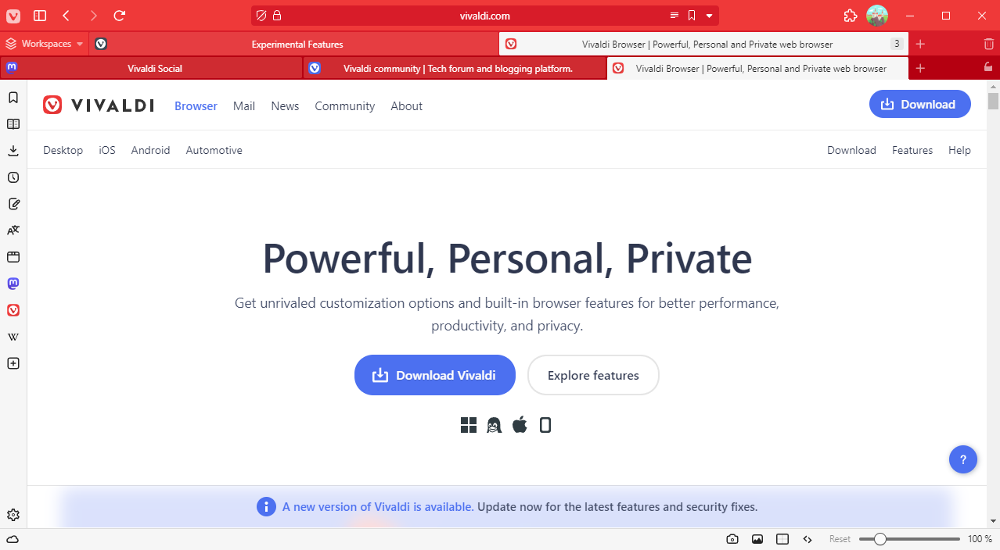

# Antonio Lucio

Antonio Lucio is a CSS modification for [Vivaldi Browser](https://vivaldi.com) that likens its appearance to the web browser of that one company with a fruit in their logo.

## Usage Notes

Antonio Lucio will only be applied when all of the following are true:

- Tab Bar Position is set to "Top"
- "Show Tab Bar" is checked
- Address Bar Position is set to "Top"
- "Show Address Bar" is checked
- For the current theme, "Accent on Window" is checked
- For the current theme, "Transparent Tab Bar" is **not** checked

## Customizing Antonio Lucio

The look and feel of Antonio Lucio can be customized through [Command Chain Flags](/documentation/command-chain-flags.md) without having to modify any CSS code.

For example, to disable the tabs being stretched to full width:

1. [Create a Command Chain](https://help.vivaldi.com/desktop/shortcuts/command-chains/#Create_a_Command_Chain) with the name `al-disable-tabbar-full-width`.
2. [Open the Toolbar Editor](https://help.vivaldi.com/desktop/appearance-customization/edit-toolbars/#Customize_toolbars) and select "Command Chains" from the dropdown. Grab your created Command Chain and drag it into one of your toolbars.

## Roadmap

Antonio Lucio will be updated regularly to ensure compatibility with the latest stable version of Vivaldi Browser. New functionality may also be added in the future.

[Click here](./documentation/roadmap.md) for more information on planned features and known issues.

---

Copyright (c) 2023 HKayn <https://hkayn.com>
